# Docker installation

Make project working directory directory `/opt/kdmid-bot`

```bash
mkdir -p /opt/kdmid-bot
cd /opt/kdmid-bot
```

Make file `docker-install.sh` somewhere on a disk, paste following content below:

```bash
sudo apt-get update

sudo apt-get install \
    ca-certificates \
    curl \
    gnupg \
    lsb-release

curl -fsSL https://download.docker.com/linux/ubuntu/gpg | sudo gpg --dearmor -o /usr/share/keyrings/docker-archive-keyring.gpg

echo \
  "deb [arch=$(dpkg --print-architecture) signed-by=/usr/share/keyrings/docker-archive-keyring.gpg] https://download.docker.com/linux/ubuntu \
  $(lsb_release -cs) stable" | sudo tee /etc/apt/sources.list.d/docker.list > /dev/null

sudo apt-get update
sudo apt-get install docker-ce docker-ce-cli containerd.io docker-compose-plugin
sudo docker run hello-world
```

Run commands to execute script properly:

```bash
chmod +x docker-install.sh
./docker-install.sh
```

## 2Captcha key obtaining:

1. Follow link [2captcha registration page](https://2captcha.com/auth/register?userType=customer)
2. Register
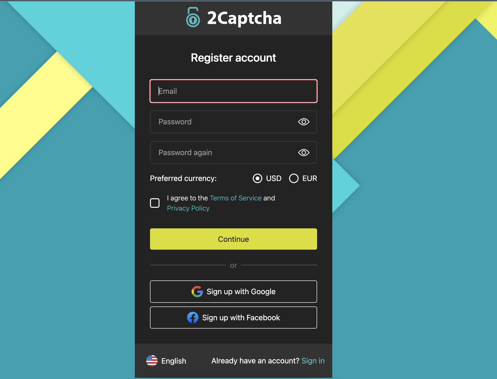
3. Add funds to profile
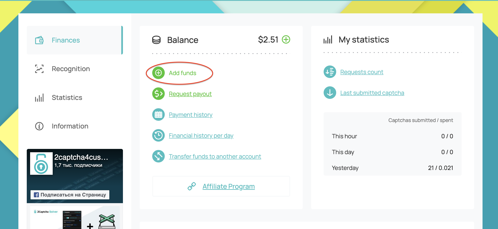
4. Copy API key 
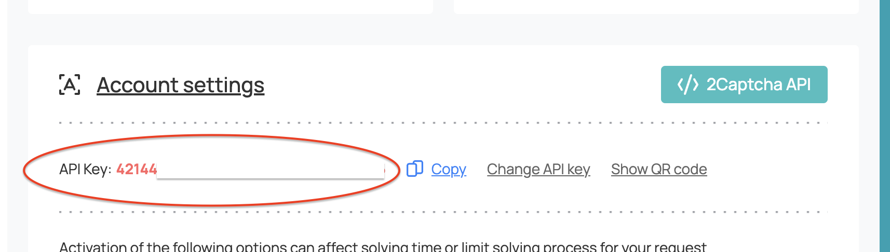
5. Paste API key into `.env` file, as `TWO_CAPTCHA_KEY` value
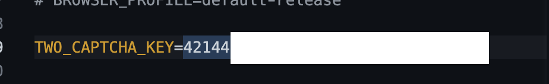

## Telegram key obtaining

1. Type in telegram search field `botfather` or follow the link [https://t.me/BotFather](https://t.me/BotFather)
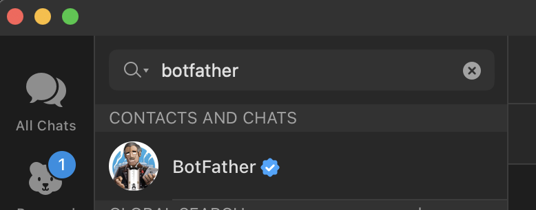
2. Press menu button on the left to message field -> Select `/newbot` command
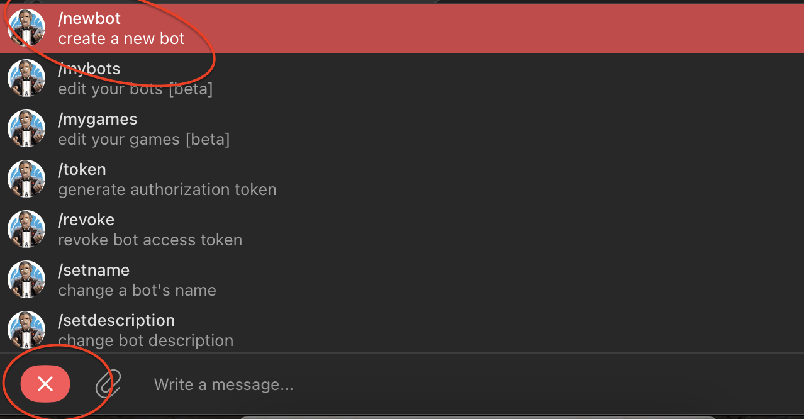
3. Follow bot creating wizard:
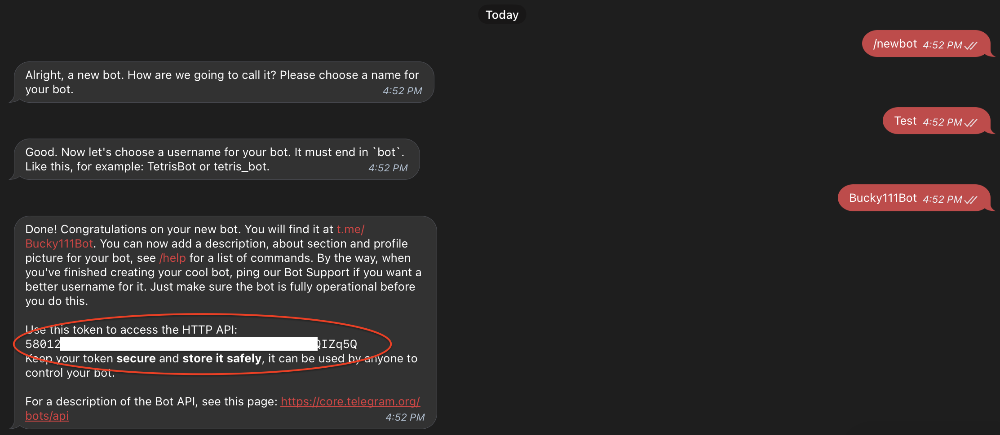
4. Copy access token and fill it into `.env` file as `TELEGRAM_TOKEN` value:
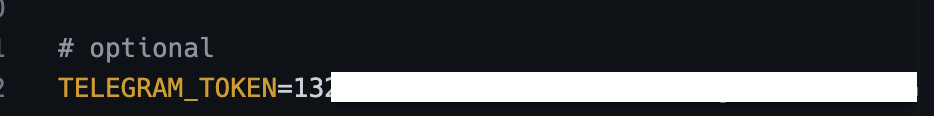
5. Now, open web version of telegram - [web telegram](https://web.telegram.org/), find your bot and open chat with it
6. Point your cursor on it's avatar, click right button -> inspect element. Find element `class=peer-title` and copy attribute `data-peer-id`
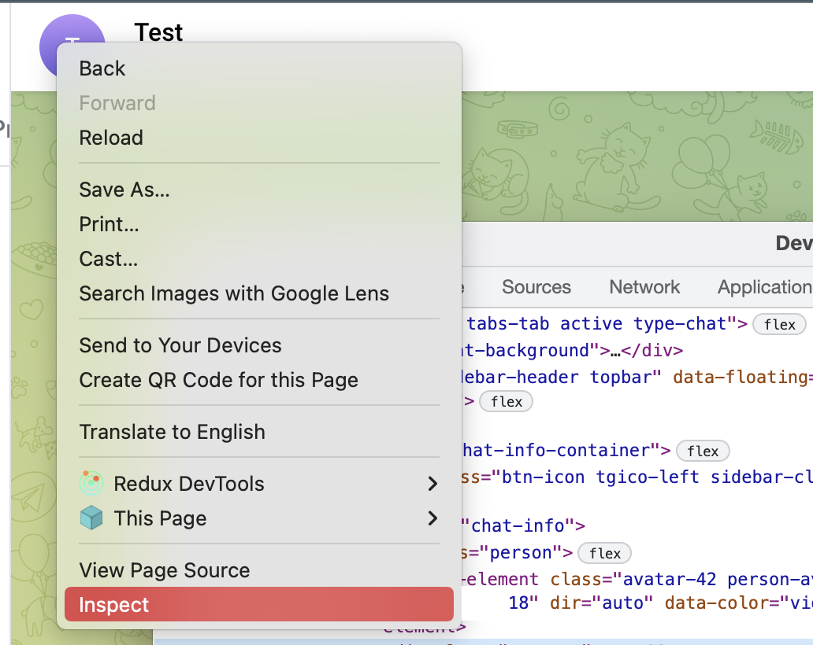
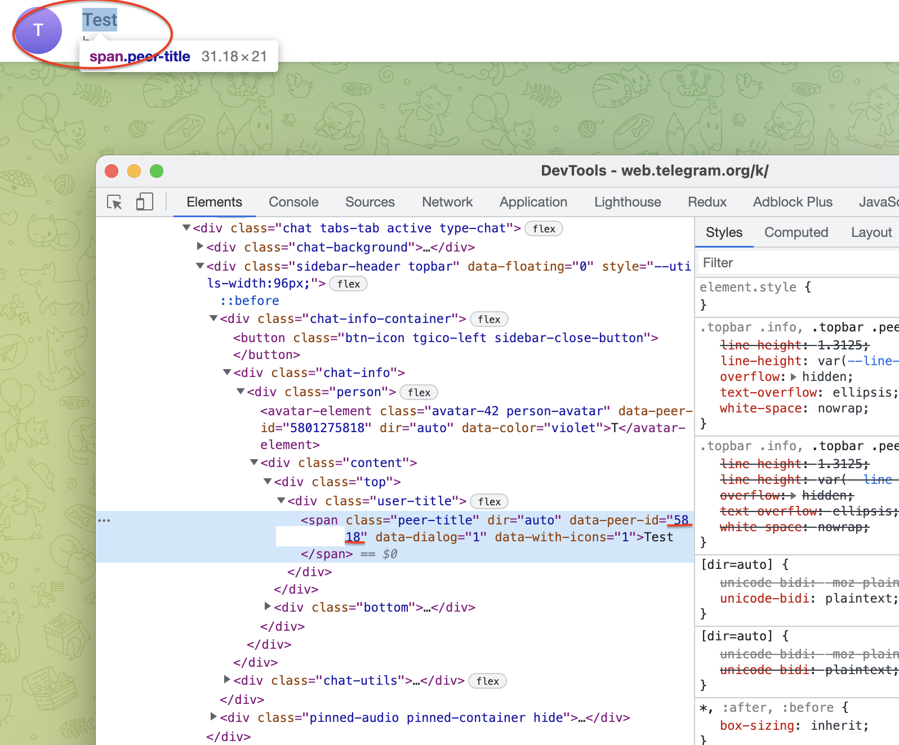
7. Put value from previous step in `.env` file as `TELEGRAM_TOKEN_ID` value
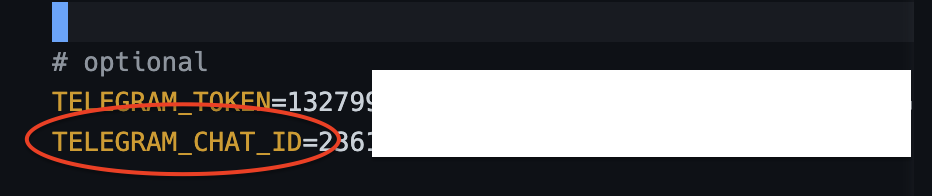
